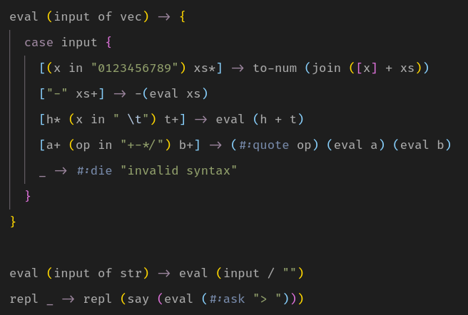

# Rydesta

Rydesta is my N-th try of writing a pattern-oriented programming language.

> Note: this is a slow, buggy experiment. Do not use in production. But
> do read the source and help me if you can `\_(*_*)_/`.

+ Factorial

  

+ Or a one-pass, left-to-right calculator that doesn't understand precedence (and arguably works)

  

Note that much of the stuff will (hopefully) change over time!

#### Why use it?

+ You like prototype stuff;
+ You like when things panic miserably and you don't know what to do about it;
+ You've got nowhere to rush: sitting and waiting for the snail to go uphill
  is the favorite hobby of yours.

#### Why not?

Negate all the above. Plus it's written in Python, the language I'm rather
addicted to (i.e., I always come back to Python). Plus there were a lot
of bad decisions that I shouldn't have taken, but I did take them and, perhaps, lost.

#### Strengths

Rydesta posesses three strengths: function overloading, reflectivity and patterns.

#### And Weaknesses

Rydesta posesses three weaknesses: function overloading, refle...

### Usage as for the moment

Clone the repo, `cd` into it, grab a python, and `import rydesta`.

```python
  reader = rydesta.Reader()
  reader.update('say "Hello, World!"')
  print(rydesta.pretty(reader))
```

Do `help(Reader)` to see the top-level documentation, which is all you (and
the interpreter) need to know about to properly interact with the reader.
